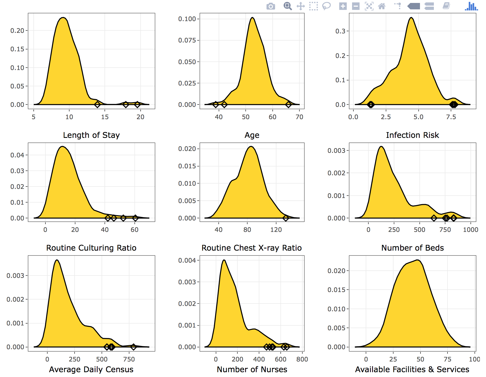
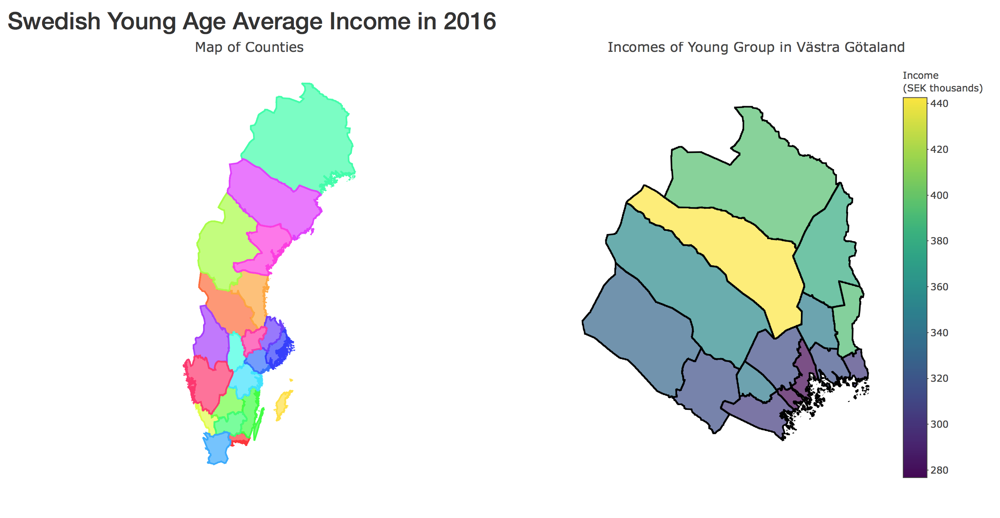
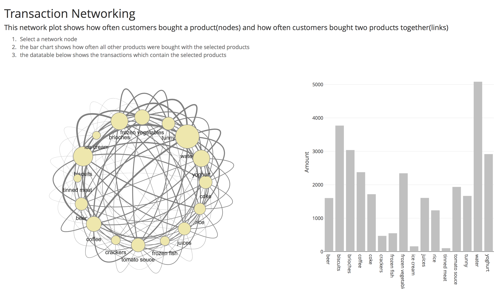

Visualization
================

Introduction
------------

Some visualization labs.

All of them are basically created by shiny, plot\_ly, or ggplot2.

------------------------------------------------------------------------

Examples
--------

#### Shiny app

Here are some examples that you can see from shinyapp.io

##### [eventdata](https://shihs.shinyapps.io/Special_Task_1/): Denstiy plots with interaction. Code is [here](https://github.com/shihs/Visualization-Course/tree/master/eventdata)

##### [map](https://shihs.shinyapps.io/Special_Task_2/): Zoom in a map. Code is [here](https://github.com/shihs/Visualization-Course/tree/master/map)

##### [network](https://shihs.shinyapps.io/Special_Task_3/): Network interactive plots. Code is [here](https://github.com/shihs/Visualization-Course/tree/master/network)

